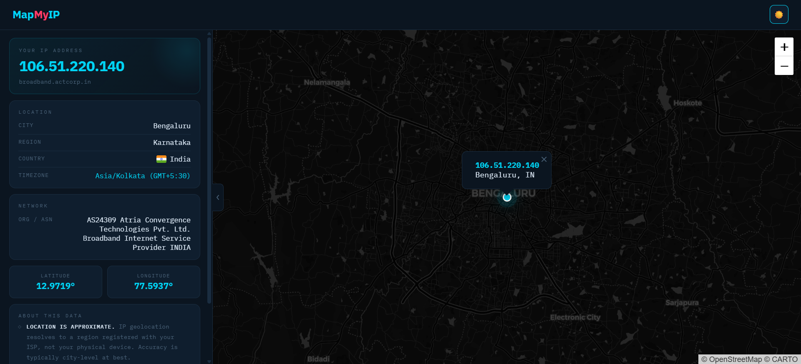

# MapMyIP

MapMyIP is a modern, full-stack web application that detects your public IP address and visualizes your approximate geographic location on an interactive map. Built with Flask and Leaflet.js, it combines a powerful backend with a beautifully designed responsive frontend that works seamlessly on desktop and mobile devices.

## Screenshots

### Loading Page


### Home Page


## 📖 Table of Contents

- [Features](#features)
- [Architecture Overview](#architecture-overview)
- [Tech Stack](#tech-stack)
- [Quick Start](#quick-start)
- [Configuration](#configuration)
- [Project Structure](#project-structure)
- [Contributing](#contributing)
- [License](#license)

---

## ✨ Features

- **IP Detection**: Automatically detects visitor's IP, handling proxies and load balancers
- **Interactive Mapping**: Real-time geolocation visualization using Leaflet.js and OpenStreetMap
- **Detailed Information**: City, region, country, timezone, ISP/ASN, and coordinates
- **Responsive Design**: Desktop sidebar layout and mobile bottom sheet interface
- **Dark/Light Theme**: Automatic OS detection with manual toggle support
- **Performance**: Skeleton loading states, optimized API session reuse, smooth animations, and database caching to reduce external API calls
- **Transparency**: Includes disclaimers about IP geolocation accuracy and VPN/proxy usage

---

## 🏗️ Architecture Overview

```
                                ┌─────────────────────────────────────────────┐
                                │         Client (Browser)                    │
                                │  ┌───────────────────────────────────────┐  │
                                │  │ HTML / CSS / JS (UI Layer)            │  │
                                │  │ • Triggers API call                   │  │
                                │  │   fetch('/ip-details')                │  │
                                │  └──────────────┬────────────────────────┘  │
                                └─────────────────┼───────────────────────────┘
                                                  │ HTTP Request
                                                  ▼
                                ┌─────────────────────────────────────────────┐
                                │        Flask Application (API Layer)        │
                                │  ┌───────────────────────────────────────┐  │
                                │  │ routes.py (Controller Layer)          │  │
                                │  │ • Parses request                      │  │
                                │  │ • Extracts client IP                  │  │
                                │  │ • Calls service layer                 │  │
                                │  │ • Returns JSON response               │  │
                                │  └──────────────┬────────────────────────┘  │
                                │                 │                           │
                                │  ┌──────────────▼────────────────────────┐  │
                                │  │ services/ip_service.py                │  │
                                │  │ (Business Logic Layer)                │  │
                                │  │ • Cache-first strategy                │  │
                                │  │   1. Check DB (cache hit?)            │  │
                                │  │   2. If miss → call external API      │  │
                                │  │   3. Persist result in DB             │  │
                                │  │ • Data normalization                  │  │
                                │  │ • Error handling & fallback           │  │
                                │  └──────────────┬────────────────────────┘  │
                                │                 │                           │
                                │  ┌──────────────▼────────────────────────┐  │
                                │  │ queries/ip_queries.py                 │  │
                                │  │ (Data Access Layer)                   │  │
                                │  │ • Abstract DB operations              │  │
                                │  │ • Insert / Fetch IP records           │  │
                                │  └──────────────┬────────────────────────┘  │
                                │                 │                           │
                                │  ┌──────────────▼────────────────────────┐  │
                                │  │ models.py (ORM Layer)                 │  │
                                │  │ • IPDetails schema (SQLAlchemy)       │  │
                                │  └──────────────┬────────────────────────┘  │
                                │                 │                           │
                                │  ┌──────────────▼────────────────────────┐  │
                                │  │ extensions.py                         │  │
                                │  │ • Initializes DB (SQLAlchemy)         │  │
                                │  └──────────────┬────────────────────────┘  │
                                └──────────┬──────────────────────┬───────────┘
                                           │                      │
                                           ▼                      ▼
            ┌────────────────────────────────────────┐   ┌──────────────────────────────────────┐
            │     PostgreSQL (Persistence Layer)     │   │     External Service (IPInfo API)    │
            │  • Stores cached IP data               │   │  • Provides IP geolocation data      │
            │  • Reduces redundant API calls         │   │  • Network-bound dependency          │
            └────────────────────────────────────────┘   └──────────────────────────────────────┘
```

---

## 🛠️ Tech Stack

| Layer | Technology |
|-------|-----------|
| **Frontend** | HTML5, CSS3, JavaScript |
| **Backend** | Python 3, Flask |
| **Database** | PostgreSQL |
| **API** | IPInfo |

---

## 🚀 Quick Start

### Prerequisites
- Python 3.8 or higher
- IPInfo API token (free tier: [ipinfo.io](https://ipinfo.io))

### Setup

```bash
# Clone the repository
git clone https://github.com/AdityaKarun/mapmyip.git
cd mapmyip

# Create and activate virtual environment
python -m venv venv
source venv/bin/activate  # On Windows: venv\Scripts\activate

# Install dependencies
pip install -r requirements.txt

# Configure environment
cp .env.example .env
# Edit .env and add your IPInfo token

# Run the application
python run.py

# Open http://localhost:5000 in your browser
```

---

## ⚙️ Configuration

### Getting an IPInfo API Token

1. Visit [ipinfo.io](https://ipinfo.io)
2. Sign up for a free account (10,000 API calls/month)
3. Copy your API token from the dashboard
4. Add it to your `.env` file:

```bash
IPINFO_TOKEN=your_token_here
```

### Setting up PostgreSQL Database

1. Install PostgreSQL on your system or use a cloud service (e.g., Heroku Postgres, AWS RDS)
2. Create a database for the application
3. Add the database connection URL to your `.env` file:

```bash
DATABASE_URL=postgresql://<DB_USER>:<DB_PASSWORD>@<DB_HOST>:<DB_PORT>/<DB_NAME>
```

For production deployments, use environment variables provided by your hosting platform.

---

## 📂 Project Structure

```
mapmyip/
│
├── app/
│   ├── __init__.py              # App factory & database setup
│   ├── extensions.py            # Flask extensions (SQLAlchemy)
│   ├── models.py                # Database models (IPDetails)
│   ├── routes.py                # API endpoints
│   ├── queries/
│   │   └── ip_queries.py        # Database query functions
│   ├── services/
│   │   └── ip_service.py        # IPInfo integration & caching logic
│   ├── static/
│   │   ├── css/
│   │   │   └── style.css        # Responsive styles & themes
│   │   └── js/
│   │       └── script.js        # Interactive features
│   └── templates/
│       └── index.html           # Main template
│
├── .env.example                 # Environment template
├── .gitignore                   # Git ignore rules
├── LICENSE                      # Project license
├── Procfile                     # Deployment configuration
├── README.md                    # Project documentation
├── requirements.txt             # Python dependencies
└── run.py                       # Entry point
```

---

## 🤝 Contributing

Contributions are welcome! Fork the repository, create a feature branch, make your changes, and submit a pull request.

---

## 📄 License

This project is open source and available under the **MIT License**. See the [LICENSE](LICENSE) file for details.

---

<div align="center">Made with ❤️ by Aditya Karun</div>